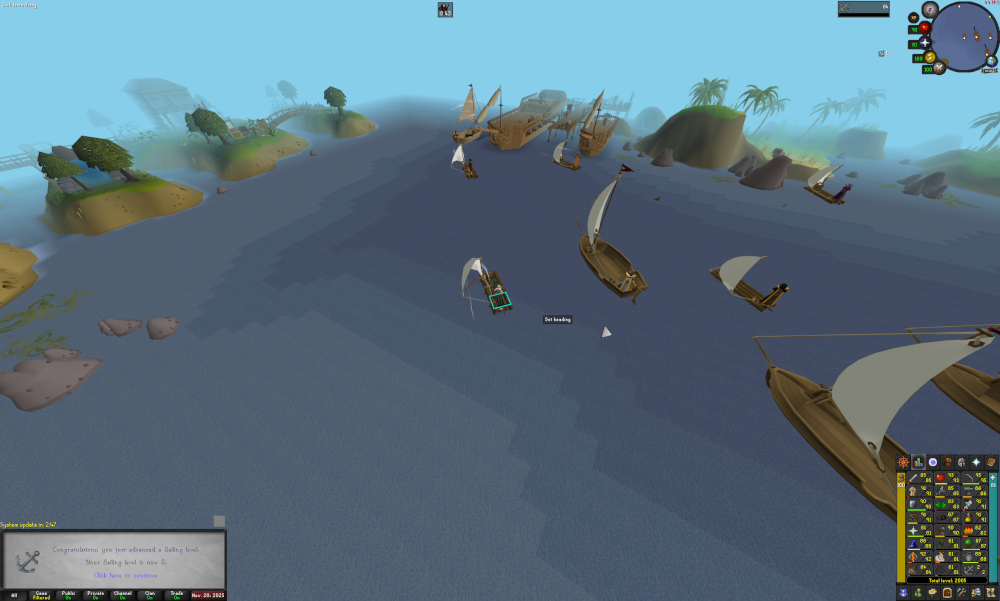
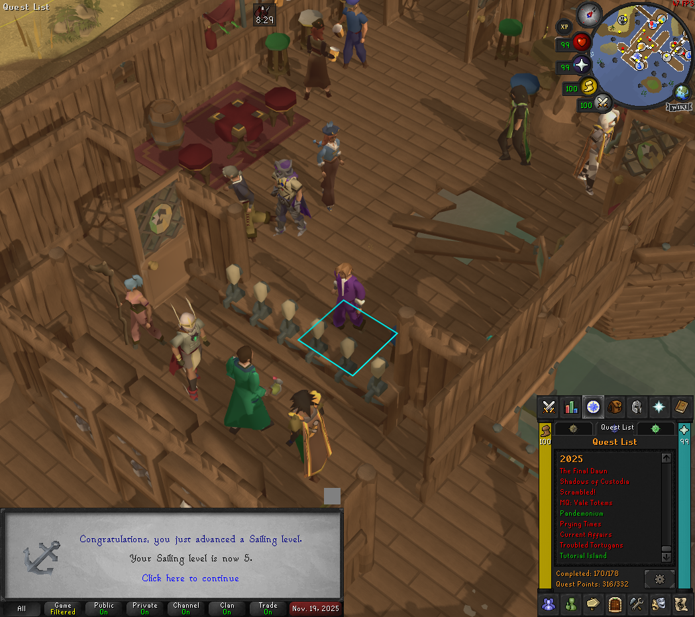
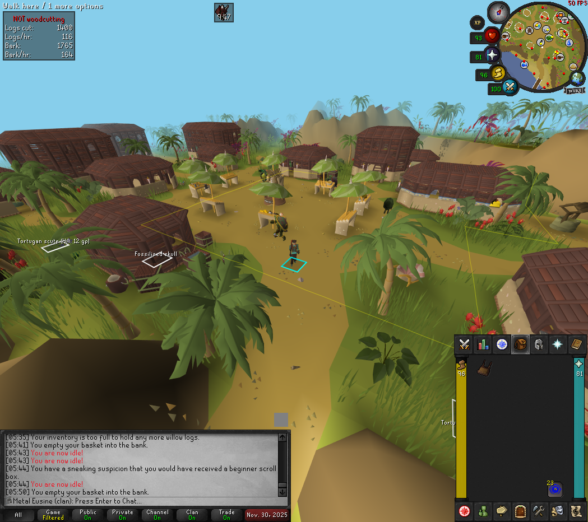
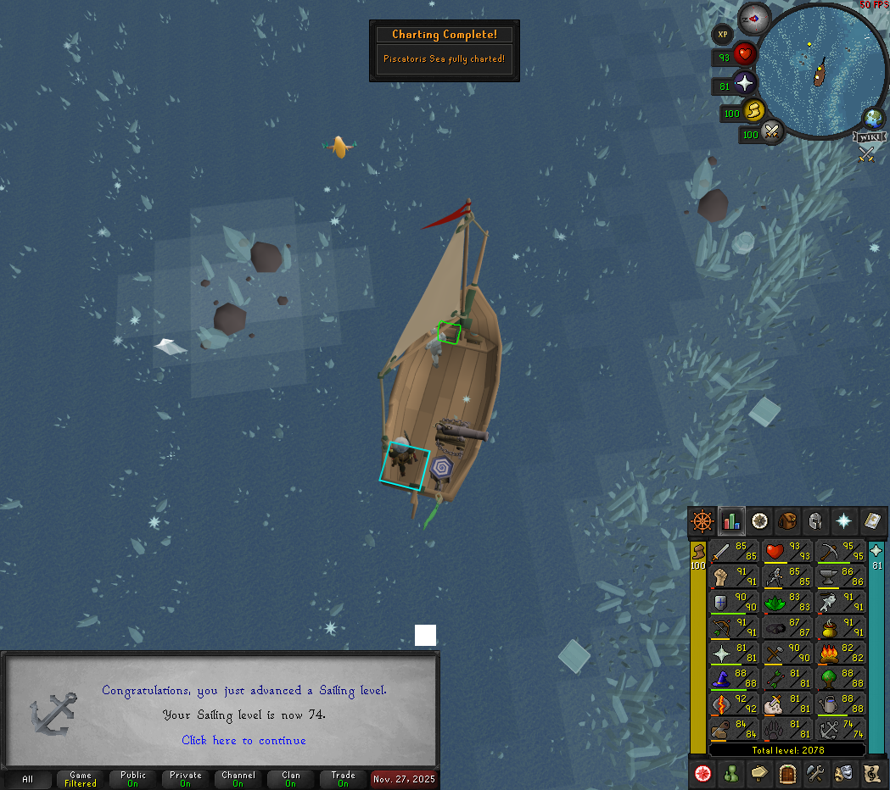
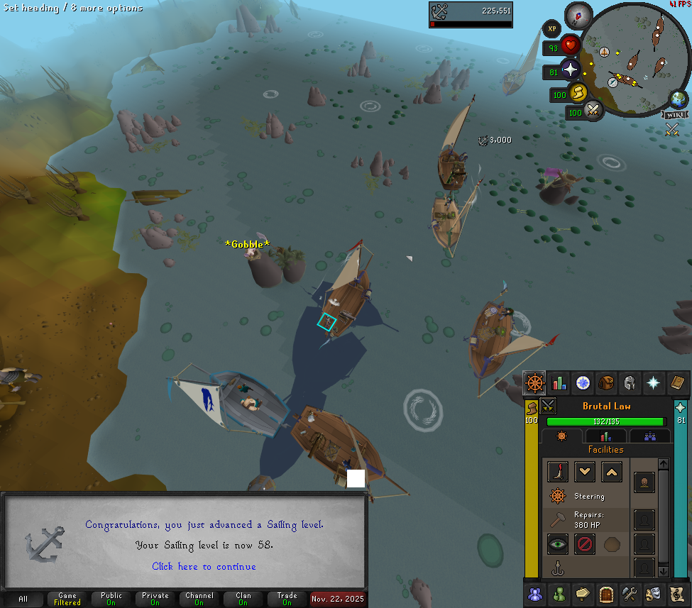
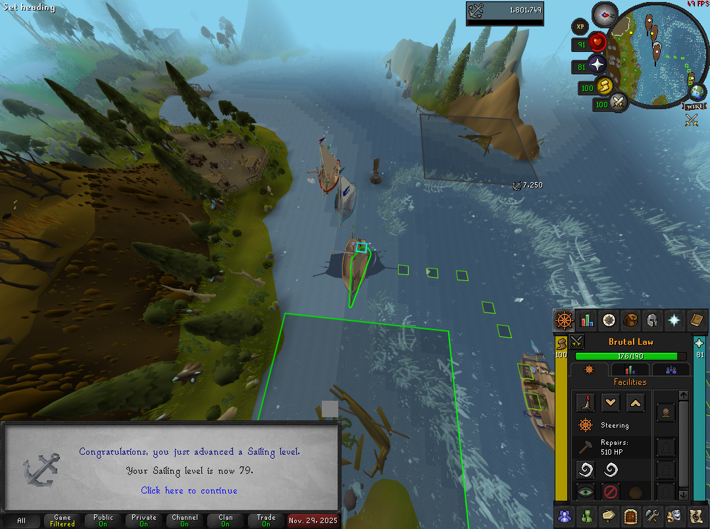

Old School Runescape released its first new skill after running for 12 years
[12 days ago](https://osrs.runescape.com/sailing), in which time I've played
most of the new content. This includes completing the four new quests, playing
the three barracuda trials, and charting the entire ocean. Here, I'll document
the thoughts, feelings and experiences I've had since setting sail nearly 2
weeks ago.

## Launch Day
Upon logging in on Wednesday the 19th and heading over to Port Sarim to begin
the first new quest, _Pandemonium_, I was able to board an NPC-owned ship and
sail to the new starting area for the new skill, which the quest is named after.
Having been trialled by players beforehand in several open tests, the ship
controlled satisfyingly and moved in a believable way.

During this early play time, I was immediately struck by the quality of the new
audio tracks. As somebody who enjoys the style and feel of the music in this
game, I felt both that the new music was enjoyable to listen to
([Yo Ho Ho!](https://oldschool.runescape.wiki/w/Yo_Ho_Ho!), a bouncy jig which
plays while on the Pandemonium, became an instant classic for me), and that it
fit in perfectly with the existing library of music tracks.

The early pre-barracuda trials experience gained mostly through charting the
seas and port tasks, which are generally agreed to be essentially Amazon/FedEx
on water, felt somewhat underwhelmingly slow on release day. This was quickly
remedied, however, as I played through these parts again the next day on my
Ironman account after the bond ran out on my main, and found it much smoother
and more satisfying.

## Quests
I found that the quests were paced well throughout the levelling journey to mix
up the training methods with story content, as well as unlock additional sea
charting methods to evolve how the seas are charted with each one.

### Pandemonium
This quest is the first introduction to the sailing skill at level 1. It
introduces the player to the mechanics of controlling ships, to the starting
area of the same name, and allows the player to get their hands on their first
vessel - the raft.

### Prying Times
This one takes place at level 12 sailing, after the player has had some time
to get to grips with sailing their raft. It involves the player making a
scripted delivery from Port Sarim, ensuring they have a solid grasp of this
basic mechanic, and visiting an old favourite character in an irreverant short
story event, in which they gain access to a new sailing tool _the crowbar_,
which allows them to pry open sealed crates around the open world seas, and
sample the alcoholic contents within, often with humourous results.

Unlocking the crowbar, as with all subsequent tool unlocks, encourages the
player to revisit seas already charted to further their progress toward charting
the entire ocean. This can be made more lucrative by taking on port deliveries
to ports in said seas to almost passively gain experience along the way.

### Current Affairs
Another humourous and irreverent quest taking place in the long-beloved town of
Catherby. This one unlocks the _current duck_: a live duck which can be released
at locations in the open world where ripples are visible on the water. For each
of these, the duck is released and must be followed to its destination, granting
experience from the knowledge imparted by the duck's path through the currents.

I found this mechanic enjoyable enough to not get boring over the course of
charting the entire ocean, although I have heard other players writing it off
as boring and tedious content.

### Troubled Tortugans
The final quest takes place at level 45 sailing, introducing the much
anticipated landmass _The Great Conch_, and its _Tortugan_ inhabitants. It
introduces the lore of the island and grants the player access to it and its
resources, including new _Jatoba_ and _Camphor_ trees for the woodcutting skill,
with camphor wood being used alongside adamantite in shipbuilding, and
_Gryphons_ and the _Shellbane Gryphon_ for the slayer skill, with the Shellbane
Gryphon dropping a new midgame stab weapon.

The new island is beautiful, and the plot leaves me curious about what will
be next for the Tortugans, and how my character will gain further acceptance
from them, in order to access some of the restricted parts of the Great Conch.

## Sea Charting
After the quests are finished, the nine exploreable oceans remain to be charted:
the remainder of the Ardent Ocean, which is between the Kharidian desert and the
Feldip hills, and where all of the content so far has been, as well as the eight
others in the new areas to the South and West, as well as between the existing
areas between Tirannwn and Zeah and the various Fremmenik- and Troll-populated
areas to the North.

Two charting methods are unlocked outside of quests: diving with mermaid guides
and charting weather patterns for the meteorologist troll _Meaty Aura Logist_,
at level 38 and 57 sailing respectively.

The mermaid guides require solving cryptic word puzzles before diving and,
disappointingly for some, don't show the sea bed. I found most of these too
cryptic to solve and relied on the excellent
[OSRS Wiki](https://oldschool.runescape.wiki) for the answers.

Charting weather patterns require using the portable weather station provided
by the troll to measure the circular path of the wind, and find the centre. By
the time I got to this level, the sailing plugin for RuneLite was able to show
the solutions for these, which I am glad of because of the precision required
for the game to recognise that the player is in the centre of the weather
pattern. The radius could do with being increased, and I wouldn't be eager to
try solving more of these without this change.

While exploring the Western Ocean, I first heard my favourite new music track:
[A Sailor's Dream](https://oldschool.runescape.wiki/w/A_Sailor%27s_Dream),
composed by _Alan Walker_, an artist I'm not too familiar with but know some of
my friends are big fans. It's exciting that Jagex managed to get an artist of
this calibre on board with the project, especially for the publicity the game
will receive as a result.

## Barracuda Trials
The _Barracuda Trials_ are the high-attention, high experience activity,
described by Jagex as the sailing counterpart to agility's _Hallowed Sepulchre_.
They are refreshingly forgiving for the purpose of getting experience, as
experience is still granted even when the target time was not achieved, but the
later trials can be extremely frustrating when trying to earn the rewards for
achieving the times, not helped by the fact that the sailing code seems to need
some post-release optimisation, suggested by many players, including myself,
experiencing reduced framerate and dead clicks when many players are playing the
trials.

Achieving the top rank, _Marlin_, in these trials unlocks a flag which is flown
at the rear of the player's boat to signal their skill to others. This feels
rewarding in a similar way to untradeable cape slot items equipped by the player
that signal their mastery over PvM content.

### The Tempor Tantrum
I found this first trial to be the perfect balance between too easy and too
frustrating - once I got to grips with the intended approach, I was able to
achieve the Marlin rank after a few attempts without a guide, and racked up
a satisfying chunk of experience during those attempts.

_The Storm Tempor_, in which this trial takes place, is an opportunity well
taken to flesh out the storm introduced with the third group skilling boss
_Tempoross_. I enjoyed exploring the course and seeing the island on which
Tempoross is fought in the middle.

### The Jubbly Jive
This was the first point in this content that I experienced real frustration.
I found the mechanics unintuitive to begin with, but figured it out before long;
this would have been acceptable on its own. What made it aggravating was the
aforementioned optimisation issues, causing me to often get half way around the
course before realising the I hadn't quite sailed in range of a crate or pillar,
despite it appearing that I had. This may be a problem that will fix itself when
the there are less players playing the content. As it stands, I don't plan to
revisit it on this account having achieved Marlin rank, and I dread the idea of
potentially having to play this content again on another account.

While the Feldip Hills and ogres are far from my favourite content in the game
from a lore perspective, the course fits the theme of the area and doesn't look
or feel out of place.

### The Gwenith Glide
While the mechanics are more intuitive than the Jubbly Jive, and I experienced
less performance issues here, the hitboxes still feel frustrating on this course
and the target times feel very strict, and this is the only trial I haven't yet
achieved the marlin rank for.

It looks great though, and the crystal-flecked sea design fits the area near
Prifddinas nicely.

## Sea Combat and Bounties
I tried two bounties early on, one for bull sharks and one for terns, and found
it unsatisfying — combat quickly chews through cannonballs for a disappointingly
low amount of damage. Perhaps this will be better at a higher level with better
cannons and cannonballs; I will find out when I grind out high-tier dragon boat
components from high-level sea creatures later on.

## Ship Building
I like the pace and feel of upgrades throughout the levelling process, as the
requirements for surviving various hazards and unlocking various areas make
certain milestones feel good when reached. There is a good mix of existing
materials required, some of which being under-utilised before the release of
sailing, and new sailing-specific materials such as the logs and planks from
the new trees.

Based on the short time I played the sailing content with my main account, I
personally found the Ironman play style to be preferable, as it encourages
engaging with the new content, rather than bypassing it by buying materials from
the grand exchange.

## Closing Thoughts
Sailing has been some of the most fun I have had with the game recently.
Charting the new areas in the previously unused seas around the game world feels
really good, and the new music brings the whole experience together. The issues,
particularly with the combat and barracuda trials, are frustrating, but Jagex
have an excellent track record for listening to players and adapting according
to feedback, and with more sailing updates planned I have no doubt that they will
be ironed out over the coming months.

I feel this has been a very successful launch, with overwhelmingly positive
feedback from players overall. Most of the negative feedback I have heard is due
to it not directly benefitting players' content of choice, but most of us have
enjoyed it largely as an independent experience within the existing world, that
makes it feel more complete and varied. Future content, such as the planned
sailing raid, will likely bridge this gap.

I think this expansion should be studied by game designers and developers as an
example of how a dedicated team of developers, who are themselves fans and
players of the content, can introduce an update with entirely new gameplay and
themes to an existing game in a way that doesn't negatively disrupt players,
while making the old and the new feel greater than the sum of their parts.

